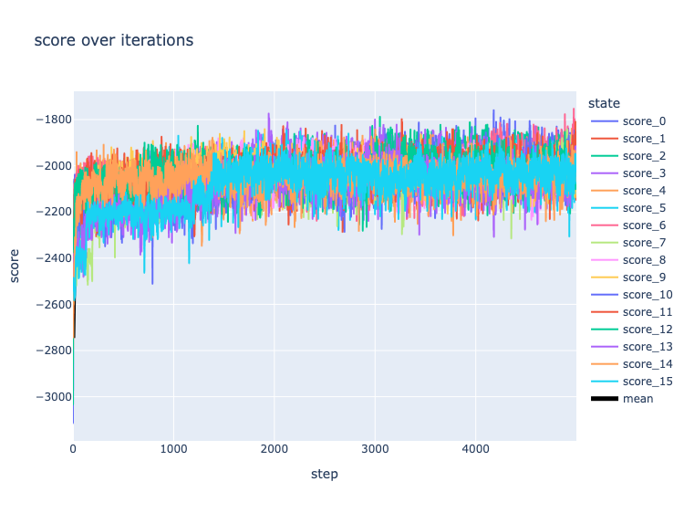

<div align=center>
    
    <h3>Lace: A Probabilistic Machine Learning tool for Scientific Discovery</h3>
</div>

</br>
</br>

<div align="center">
  
  <a href="https://github.com/promised-ai/lace/actions/workflows/rust-build-test.yaml">
    
  </a>
  <a href="https://github.com/promised-ai/lace/actions/workflows/python-build-test.yaml">
    
  </a>
  <a href="https://crates.io/crates/lace">
    
  </a>
  <a href="https://pypi.org/project/pylace">
    
  </a>
</div>

<div align=center>
     <div>
        <strong>Documentation</strong>: 
        <a href='https://www.lace.dev/'>User guide</a> |
        <a href='https://docs.rs/lace/latest/lace/'>Rust API</a> |
        <a href='https://pylace.readthedocs.io/en/latest/'>Python API</a> |
     </div>
    <div>
        <strong>Installation</strong>: 
        <a href='#installation'>Rust</a> | 
        <a href='#installation'>Python</a> | 
        <a href='#installation'>CLI</a>
     </div>
    <div>
        <strong>Contents</strong>: 
        <a href='#the-problem'>Problem</a> | 
        <a href='#quick-start'>QUICK START</a> | 
        <a href='#license'>License</a>
     </div>
</div>

</br>
</br>

Lace is a probabilistic cross-categorization engine written in rust with an
optional interface to python. Unlike traditional machine learning methods, which
learn some function mapping inputs to outputs, Lace learns a joint probability
distribution over your dataset, which enables users to...

- predict or compute likelihoods of any number of features conditioned on any
  number of other features
- identify, quantify, and attribute uncertainty from variance in the data,
  epistemic uncertainty in the model, and missing features
- determine which variables are predictive of which others
- determine which records/rows are similar to which others on the whole or
  given a specific context
- simulate and manipulate synthetic data
- work natively with missing data and make inferences about missingness
  (missing not-at-random)
- work with continuous and categorical data natively, without transformation
- identify anomalies, errors, and inconsistencies within the data
- edit, backfill, and append data without retraining

and more, all in one place, without any explicit model building.

```python
import pandas as pd
import lace

# Create an engine from a dataframe
df = pd.read_csv("animals.csv", index_col=0)
engine = lace.Engine.from_df(df)

# Fit a model to the dataframe over 5000 steps of the fitting procedure
engine.update(5000)

# Show the statistical structure of the data -- which features are likely
# dependent (predictive) on each other
engine.clustermap("depprob", zmin=0, zmax=1)
```


## The Problem

The goal of lace is to fill some of the massive chasm between standard machine
learning (ML) methods like deep learning and random forests, and statistical
methods like probabilistic programming languages. We wanted to develop a
machine that allows users to experience the joy of discovery, and indeed
optimizes for it.

### Short version

Standard, optimization-based ML methods don't help you learn about your data.
Probabilistic programming tools assume you already have learned a lot about
your data. Neither approach is optimized for what we think is the most
important part of data science: the science part: asking and answering questions.

### Long version

Standard ML methods are easy to use. You can throw data into a random forest
and start predicting with little thought. These methods attempt to learn a
function f(x) -> y that maps inputs x, to outputs y. This ease-of-use comes at
a cost. Generally f(x) does not reflect the reality of the process that
generated your data, but was instead chosen by whoever developed the approach
to be sufficiently expressive to better achieve the optimization goal. This
renders most standard ML completely uninterpretable and unable to yield sensible
uncertainty estimate.

On the other extreme you have probabilistic tools like probabilistic
programming languages (PPLs). A user specifies a model to a PPL in terms of a
hierarchy of probability distributions with parameters θ. The PPL then uses a
procedure (normally Markov Chain Monte Carlo) to learn about the *posterior*
distribution of the parameters given the data p(θ|x). PPLs are all about
interpretability and uncertainty quantification, but they place a number of
pretty steep requirements on the user. PPL users must specify the model
themselves from scratch, meaning they must know (or at least guess) the model.
PPL users must also know how to specify such a model in a way that is
compatible with the underlying inference procedure.

### Example use cases

- **Combine data sources and understand how they interact.** For example, we
    may wish to predict cognitive decline from demographics, survey or task
    performance, EKG data, and other clinical data. Combined, this data would
    typically be very sparse (most patients will not have all fields filled
    in), and it is difficult to know how to explicitly model the interaction of
    these data layers. In Lace, we would just concatenate the layers and run
    them through.
- **Understanding the amount and causes of uncertainty over time.** For
    example, a farmer may wish to understand the likelihood of achieving a
    specific yield over the growing season. As the season progresses, new
    weather data can be added to the prediction in the form of conditions.
    Uncertainty can be visualized as variance in the prediction, disagreement
    between posterior samples, or multi-modality in the predictive distribution
    (see [this blog post](https://redpoll.ai/blog/ml-uncertainty/) for more
    information on uncertainty)
- **Data quality control.** Use `surprisal` to find anomalous data in the table
    and use `-logp` to identify anomalies before they enter the table. Because
    Lace creates a model of the data, we can also contrive methods to find data
    that are *inconsistent* with that model, which we have used to good effect
    in error finding.

### Who should not use Lace

There are a number of use cases for which Lace is not suited

- Non-tabular data such as images and text
- Highly optimizing specific predictions
    + Lace would rather over-generalize than over fit.


## Quick start

### Installation

Lace requires rust.

To install the CLI:
```
$ cargo install --locked lace-cli
```

To install pylace

```
$ pip install pylace
```

### Examples

Lace comes with two pre-fit example data sets: Satellites and Animals.

```python
>>> from lace.examples import Satellites
>>> engine = Satellites()

# Predict the class of orbit given the satellite has a 75-minute
# orbital period and that it has a missing value of geosynchronous
# orbit longitude, and return epistemic uncertainty via Jensen-
# Shannon divergence.
>>> engine.predict(
...     'Class_of_Orbit',
...     given={
...         'Period_minutes': 75.0,
...         'longitude_radians_of_geo': None,
...     },
... )
('LEO', 0.023981898950561048)

# Find the top 10 most surprising (anomalous) orbital periods in
# the table
>>> engine.surprisal('Period_minutes') \
...     .sort('surprisal', reverse=True) \
...     .head(10)
shape: (10, 3)
┌─────────────────────────────────────┬────────────────┬───────────┐
│ index                               ┆ Period_minutes ┆ surprisal │
│ ---                                 ┆ ---            ┆ ---       │
│ str                                 ┆ f64            ┆ f64       │
╞═════════════════════════════════════╪════════════════╪═══════════╡
│ Wind (International Solar-Terres... ┆ 19700.45       ┆ 11.019368 │
│ Integral (INTErnational Gamma-Ra... ┆ 4032.86        ┆ 9.556746  │
│ Chandra X-Ray Observatory (CXO)     ┆ 3808.92        ┆ 9.477986  │
│ Tango (part of Cluster quartet, ... ┆ 3442.0         ┆ 9.346999  │
│ ...                                 ┆ ...            ┆ ...       │
│ Salsa (part of Cluster quartet, ... ┆ 3418.2         ┆ 9.338377  │
│ XMM Newton (High Throughput X-ra... ┆ 2872.15        ┆ 9.13493   │
│ Geotail (Geomagnetic Tail Labora... ┆ 2474.83        ┆ 8.981458  │
│ Interstellar Boundary EXplorer (... ┆ 0.22           ┆ 8.884579  │
└─────────────────────────────────────┴────────────────┴───────────┘
```

And similarly in rust:

```rust,noplayground
use lace::prelude::*;
use lace::examples::Example;

fn main() {	
    // In rust, you can create an Engine or and Oracle. The Oracle is an
    // immutable version of an Engine; it has the same inference functions as
    // the Engine, but you cannot train or edit data.
    let mut engine = Example::Satellites.engine().unwrap();
	
    // Predict the class of orbit given the satellite has a 75-minute
    // orbital period and that it has a missing value of geosynchronous
    // orbit longitude, and return epistemic uncertainty via Jensen-
    // Shannon divergence.
    engine.predict(
        "Class_of_Orbit",
        &Given::Conditions(vec![
            ("Period_minutes", Datum:Continuous(75.0)),
            ("Longitude_of_radians_geo", Datum::Missing),
        ]),
        Some(PredictUncertaintyType::JsDivergence),
        None,
    )
}
```

### Fitting a model

To fit a model to your own data you can use the CLI

```console
$ lace run --csv my-data.csv -n 1000 my-data.lace
```

...or initialize an engine from a file or dataframe.

```python
>>> import pandas as pd  # Lace supports polars as well
>>> from lace import Engine
>>> engine = Engine.from_df(pd.read_csv("my-data.csv", index_col=0))
>>> engine.update(1_000)
>>> engine.save("my-data.lace")
```

You can monitor the progress of the training using diagnostic plots

```python
>>> from lace.plot import diagnostics
>>> diagnostics(engine)
```



## License

Lace is licensed under the MIT licenses as of v0.9.0.
