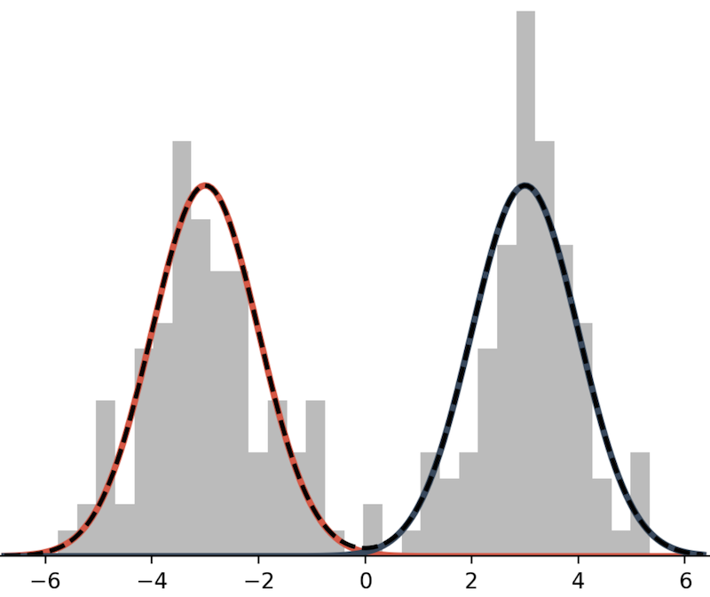

# Stats primer

## What you need to know about Bayesian Statistics

Bayesian statistics is built around the idea of *posterior inference*. The
*posterior distribution* is the probability distribution of the parameters,
\\(\theta\\), of some model given observed data, \\(x\\). In math: \\( p(\theta
| s) \\). Per Bayes theorem, the posterior distribution can be written in terms
of other distributions,

\\[
p(\theta | s) = \frac{p(x|\theta)p(\theta)}{p(x)}.
\\]

Where \\( p(x|\theta) \\) is the *likelihood* of the observations given the
parameters of our model; \\( p(\theta) \\) is the *prior distribution*, which
defines our beliefs about the model parameters in the absence of data; and \\(
p(x) \\) is the *marginal likelihood*, which the likelihood of the data
marginalized over all possible models. Of these, the likelihood and prior are
the two distributions we're most concerned with. The marginal likelihood, which
is defined as

\\[
    p(x) = \int p(x|\theta)p(\theta) d\theta
\\]

is notoriously difficult and a lot of effort in Bayesian computation goes
toward making the marginal likelihood go away, so we won't talk about it much.

## Finite mixture models

A mixture model is a weighted sum of probabilistic distributions. Here is an example of bimodal mixture model.

This mixture model is defined as the sum of two Normal distributions:

\\[
p(x) = \frac{1}{2} N(x; \mu=-3, \sigma^2=1) + \frac{1}{2} N(x; \mu=3, \sigma^2=1).
\\]

In lace, we will often use the term *mixture component* to refer to an individual model within a mixture.

In general a mixture distribution has the form

\\[
p(x|\theta) = \sum_{i=1}^K w_i \, p(x|\theta_i),
\\]

where \\(K\\) is the number of mixture components, \\(w_i\\) is the \\(i^{th}\\) weight, and all weights are positive and sum to 1.

To draw a mixture model from the prior,

1. Draw the weights, \\( w \sim \text{Dirichlet}(\alpha) \\), where \\(\alpha\\) is a \\(K\\)-length vector of values in \\((0, \infty)\\). 
2. For \\(i \in \{1, ..., K\}\\) draw \\( \theta_i \sim p(\theta) \\)

As a note, we usually use one \\(\alpha\\) value repeated \\(K\\) times rather than \\(K\\) distinct values. We do not often have reason to think that any one component is more likely than the other, and reducing a vector to one value reduces the number of dimensions in our model.

## Dirichlet process mixture models (DPMM)

Suppose we don't know how many components are in our model. Given \\(N\\) data, there could be as few as 1 and as many as \\(N\\) components. To infer the number of components or categories, we place a prior on how categories are formed. One such prior is the Dirichlet process. To explain the Dirichlet process we use the Chinese restaurant process (CRP) formalization.

The CRP metaphor works like this: you are on your lunch break and, as one often does, you to usual luncheon spot: a magical Chinese restaurant where the rules of reality do not apply. Today you happen to arrive a bit before open and, as such, are the first customer to be seated. There is exactly one table with exactly one seat. You sit at that table. Or was the table instantiated for you? Who knows. The next customer arrives. They have a choice. They can sit with you or they can sit at a table alone. Customers at this restaurant love to sit together (customers of interdimensional restaurants tend to be very social creatures), but the owners offer a discount to customers who instantiate new tables. Mathematically, a customer sits at a table with probability

\\[
  p(z_i = k) =
    \begin{cases}
        \frac{n_k}{N_{-i}+\alpha},  & \text{if $k$ exists} \\\\
        \frac{\alpha}{N_{-i}+\alpha}, & \text{otherwise}
    \end{cases},
\\]

where \\(z_i\\) is the table of customer i, \\(n_k\\) is the number of customers currently seated at table \\(k\\), and \\(N_{-i}\\) is the total number of seated customers, not including customer i (who is still deciding where to sit).

Under the CRP formalism, we make inferences about what datum belongs to which category. The weight vector is implicit. That's it. For information on how inference is done in DPMMs check out the [literature recommendations](#literature-recommendations).

