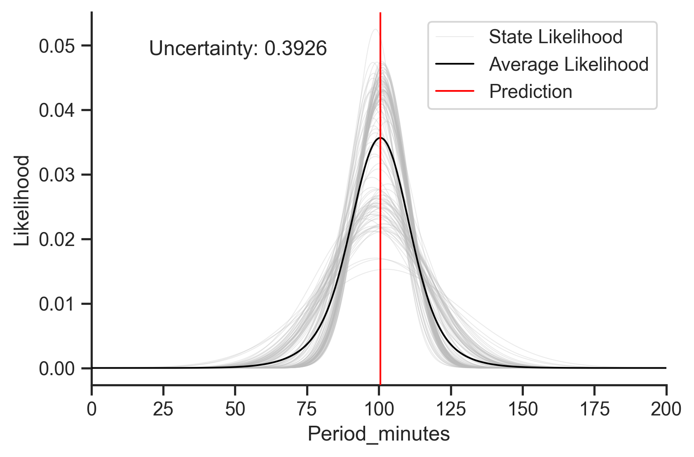

# Prediction

In Lace, prediction is simply finding \\(\text{argmax}_x \\,p(x|y)\\), the most
likely value of \\(x\\).

We can predict without or without conditions

<div class=tabbed-blocks>

```python
from lace.examples import Animals

animals = Animals()

animals.predict('swims')
# Output: (0, 0.008287057807910558)

animals.predict('swims', given={'flippers': 1})
# Output: (1, 0.05008037071634858)

animals.predict('swims', given={'flippers': 1, 'water': 0})
# Output: (0, 0.32863593091906085)
```
</div>

Note that Lace returns two values. The first is the prediction and the second
is the uncertainty. Lace predictions return *epistemic uncertainty* as opposed
to variance (which can be gotten from the likelihood directly) or confidence
intervals (which don't make sense for many data types or multi-modal continuous
data). Also note how in the last prediction above, where we ask Lace to predict
whether a non-water animal with flippers swims, that Lace returns a very high
uncertainty. Lace is telling us that it is confused.

## Uncertainty

Uncertainty comes from several sources (to learn more about those sources,
check out [this blog post](https://redpoll.ai/blog/ml-uncertainty/)):

1. Natural noise/imprecision/variance in the data-generating process
2. Missing data and features
3. Difficulty on the part of the model to capture a prediction, *epistemic
   uncertainty*

Type 1 uncertainty can be captured by computing the predictive distribution
variance (or entropy for categorical targets). You can also visualize the
predictive distribution. Observing multi-modality (multiple peaks in the
distribution) can be a good indication that you are missing valuable
information.

Lace predictions return *epistemic uncertainty*. Determining how certain the
model is in its ability to capture a prediction is done by assessing the
consensus among the predictive distribution emitted by each state. The more
alike these distributions are, the more certain the model is in its ability to
capture a prediction.

Mathematically, epistemic uncertainty is formalized as the Jensen-Shannon
divergence (JSD) between the state-level predictive distributions. Uncertainty
goes from 0 to 1, 0 meaning that there is only one way to model a prediction,
and 1 meaning that there are many ways to model a prediction and they all
completely disagree.



**Above.** Prediction uncertainty when predicting *Period_minutes* of a
satellite in the satellites data set. Note that the uncertainty value here is
driven mostly by the difference variances of the state-level predictive
distributions.

Certain ignorance is when the model has zero data by which to make a prediction
and instead falls back to the prior distribution. This is rare, but when it
happens it will be apparent. To be as general as possible, the priors for a
column's component distributions are generally much more broad than the
predictive distribution, so if you see a predictive distribution that is
senselessly wide and does not looks like the marginal distribution of that
variable (which should follow the histogram of the data), you have a certain
ignorance. The fix is to fill in the data for items similar to the one you are
predicting.

## Predicting Nothing (Missing Values)

If you try to predict the value of a `missing_not_at_random` column, and the
value is most likely missing, lace will return a missing value. Lace will admit
its ignorance.


<div class=tabbed-blocks>

```python
from lace.examples import Satellites

satellies = Satellites()

satellites.predict('longitude_radians_of_geo', given={'Class_of_Orbit': 'LEO'})
# Output: (None, 0.019257549638396987)
```

```rust,noplayground
use lace::examples::Example;
use lace::prelude;

let satllites = Example::Satellites.oracle().unwrap();

let output = oracle.predict(
    "longitude_radians_of_geo",
    &Given::Nothing,
    None,
    None,
).unwrap();

// Output: (Datum::Missing, None)
```
</div>

Note that if the predicted value in missing, Lace will return the uncertainty
with respect to missingness.

## Multivariate prediction

Lace does not natively do multivariate prediction. Under the hood, Lace does
univariate prediction by finding the global max of the requested predictive
distribution. This becomes difficult for arbitrary distributions with arbitrary
data types. The good news is that using other builtin methods, we can get
pretty close to multivariate prediction. We simulate a ton of values from the
target distribution and evaluate the likelihood of each simulated 

<div class=tabbed-blocks>

```python
values = satellites.simulate(targets, given=conditions, n=100000)
logps = satellites.logp(values, given=conditions)
# polars provides `arg_max`, nice!
values[logps.arg_max(), :]
```
</div>

Output:

```python
shape: (1, 5)
┌────────────────┬────────────────┬───────────┬────────────┬────────────────────────┐
│ Period_minutes ┆ Class_of_Orbit ┆ Apogee_km ┆ Users      ┆ Purpose                │
│ ---            ┆ ---            ┆ ---       ┆ ---        ┆ ---                    │
│ f64            ┆ str            ┆ f64       ┆ str        ┆ str                    │
╞════════════════╪════════════════╪═══════════╪════════════╪════════════════════════╡
│ 99.189408      ┆ LEO            ┆ 748.45305 ┆ Government ┆ Technology Development │
└────────────────┴────────────────┴───────────┴────────────┴────────────────────────┘
```


## Prediction & Imputation

Prediction and imputation both involve inferring an unknown quantity.
Imputation refers to inferring the value of a specific cell in our table, and
prediction refers to inferring a hypothetical value. 

The arguments for impute are the coordinates of the cell. We may wish to impute
the cell at row `bat` and column `furry`. The arguments for prediction are the
conditions we would like to use to create the conditional distribution. We may
wish to predict `furry` given `flys=True`, `brown=True`, and `fierce=False`.
