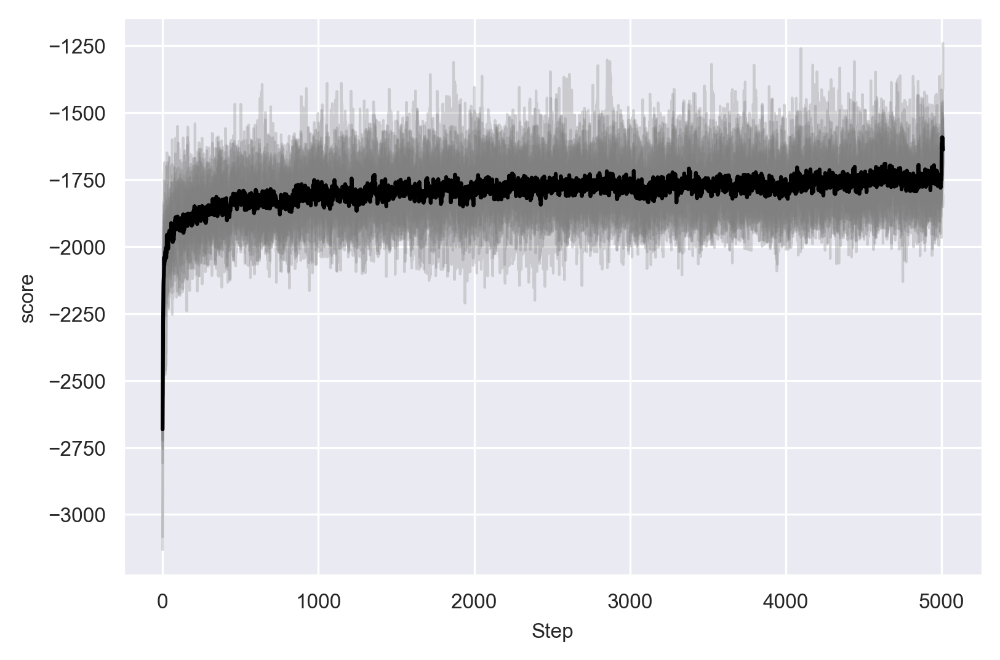
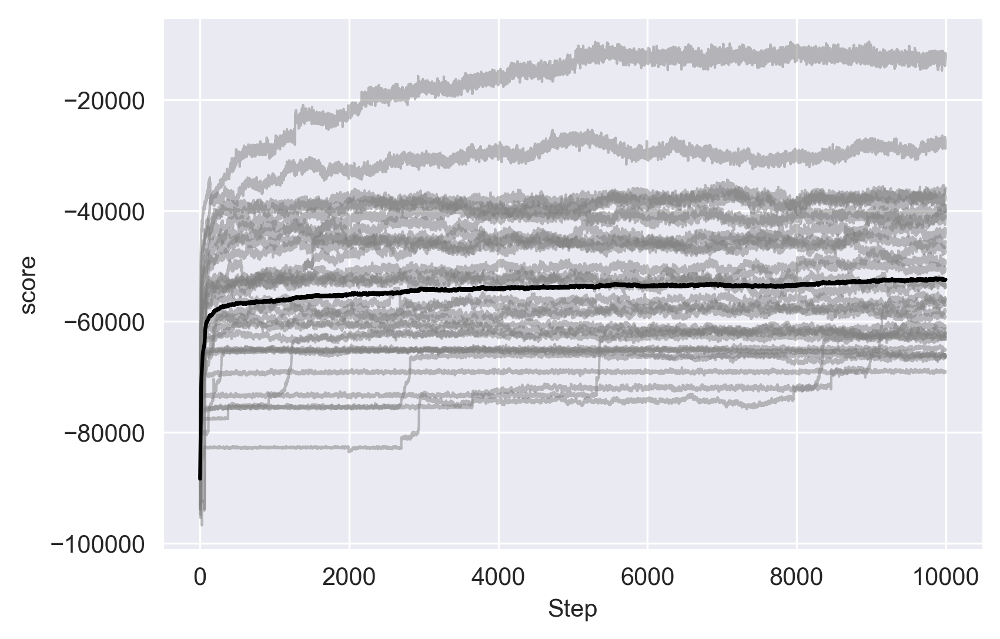

<style>
    #cf167fb8-c533-41f7-a913-8f1cca02f36b, #c4ae83ac-9e67-434d-9d97-4970352f2fe1 {
        aspect-ratio: 4/3;
    }
</style>
# Run/train/fit a model

Lace is a Bayesian tool so we do *posterior sampling* via Markov chain Monte
Carlo (MCMC). A typical machine learning model will use some sort of
optimization method to find one model that fits best; the objective for fitting
is different in Lace. 

In Lace we use a number of *states* (or samples), each running MCMC
independently to characterize the posterior distribution of the model
parameters given the data. Posterior sampling isn't meant to maximize the fit
to a dataset, it is meant to help understand the conditions that created the
data.

When you fit to your data in Lace, you have options to run a set number of
states for a set number of iterations (limited by a timeout). Each state is a
posterior sample. More states is better, but the run time of **everything**
increases linearly with the number of states; not just the fit, but also the
`OracleT` operations like `logp` and `simulate`. **As a rule of thumb, 32 is a
good default number of states.** But if you find your states tend to strongly
disagree on things, it is probably a good idea to add more states to fill in
the gaps.

As for number of iterations, you will want to monitor your convergence plots.
There is no benefit of *early stopping* like there is with neural networks.
MCMC will usually only do better the longer you run it and Lace is not likely
to overfit like a deep network.


The above figure shows the MCMC algorithm partitioning a dataset into views and
categories.

## A (potentially useless) analogy comparing MCMC to optimization

At the risk of creating more confusion than we resolve, let us make an analogy
to mountaineering. You have two mountaineers: a gradient ascent (GA)
mountaineer and an MCMC mountaineer. You place each mountaineer at a random
point in the Himalayas and say "go". GA's goal is to find the peak of Everest.
Its algorithm for doing so is simply always to go up and never to go down. GA
is guaranteed to find a peak, but unless it is very lucky in its starting
position, it is unlikely ever to summit Everest.

MCMC has a different goal: to map the mountain range (posterior distribution).
It does this by always going up, but sometimes going down if it doesn't end up
too low. The longer MCMC explores, the better understanding it gains about the
Himalayas: an understanding which likely includes a good idea of the position
of the peak of Everest.

While GA achieves its goal quickly, it does so at the cost of understanding the
terrain, which in our analogy represents the information within our data.

In Lace we place a troop of mountaineers in the mountain range of our posterior
distribution. We call individuals mountaineers *states* or samples, or chains.
Our hope is that our mountaineers can sufficiently map the information in our
data. Of course the ability of the mountaineers to build this map depends on
the size of the space (which is related to the size of the data) and the
complexity of the space (the complexity of the underlying process)

In general the posterior of a Dirichlet process mixture is indeed much like the
Himalayas in that there are many, many peaks (modes), which makes the
mountaineer's job difficult. Certain MCMC kernels do better in certain
circumstances, and employing a variety of kernels leads to better result.

## Our MCMC Kernels

The vast majority of the fitting runtime is updating the row-category
assignment and the column-view assignment. Other updates such as feature
components parameters, CRP parameters, and prior parameters, take an
(relatively) insignificant amount of time. Here we discuss the MCMC kernels
responsible for the vast majority of work in Lace: the row and column
reassignment kernels:

**Row kernels**
- **slice**: Proposes reassignment for each row to an instantiated category or
    one of many new, empty categories. Slice is good for small tweaks in the
    assignment, and it is very fast. When there are a lot of rows, `slice` can
    have difficulty creating new categories.
- **gibbs**: Proposes reassignment of each row sequentially. Generally makes
    larger moves than `slice`. Because it is sequential, and accesses data in
    random order, `gibbs` is very slow.
- **sams**: Proposes mergers and splits of categories. Only considers the rows in
    one or two categories. Proposes large moves, but cannot make the fine
    tweaks that `slice` and `gibbs` can. Since it proposes big moves, its
    proposals are often rejected as the run progresses and the state is
    already fitting fairly well.

**Column kernels**

The column kernels are generally adapted from the row kernels with some caveats.

- **slice**: Same as the row kernel, but over columns.
- **gibbs**: The same structurally as the row kernel, but uses random seed
    control to implement parallelism.

Gibbs is a good choice if the number of columns is high and mixing is a concern.

## Fitting models in code

Though the CLI is a convenient way to fit models and generate metadata files
outside of python or rust, you may often times find yourself wanting to fit in
code. Lace gives you a number of options in both rust and python.

### Rust

We first initialize a new `Engine`:

```rust,noplayground
use rand::SeedableRng;
use rand_xoshiro::Xoshiro256Plus;
use polars::prelude::{CsvReader, SerReader};
use lace::prelude::*;
use lace::examples::Example;

// Load an example file
let paths = Example::Satellites.paths().unwrap();
let df = CsvReader::from_path(paths.data)
    .unwrap()
    .has_header(true)
    .finish()
    .unwrap();

// Create the default codebook
let codebook = Codebook::from_df(&df, None, None, false).unwrap();

// Build an rng
let rng = Xoshiro256Plus::from_entropy();

// This initializes 32 states from the prior
let mut engine = Engine::new(
    32,                         
    codebook,
    DataSource::Polars(df),
    0,
    rng,
).unwrap();
```

Now we have two options for fitting. We can use the `Engine::run` method, which
uses a default set of transition operations that prioritizes speed.

```rust,noplayground
engine.run(1_000);
```

We can also tell lace exactly which transitions to run.

```rust,noplayground
// Run for 1000 iterations. Use the Gibbs column reassignment kernel, and
// alternate between the merge-split (Sams) and slice row kernels
let run_config = EngineUpdateConfig::new()
    .n_iters(100)
    .transitions(vec![
        StateTransition::ColumnAssignment(ColAssignAlg::Gibbs),
        StateTransition::StateAlpha,
        StateTransition::RowAssignment(RowAssignAlg::Sams),
        StateTransition::ComponentParams,
        StateTransition::RowAssignment(RowAssignAlg::Slice),
        StateTransition::ComponentParams,
        StateTransition::ViewAlphas,
        StateTransition::FeaturePriors,
    ]);

engine.update(run_config.clone(), ()).unwrap();
```

Note the second argument to `engine.update`. This is the update handler, which
allows users to do things like attach progress bars, handle Ctrl+C, and collect
additional diagnostic information. There are a number a built-ins for common use
case, but you can implement UpdateHandler for your own types if you need extra
capabilities. `()` is the null update handler.

If we wanted a simple progressbar

```rust,noplayground
use lace::prelude::update_handler::ProgressBar;

engine.update(run_config.clone(), ProgressBar::new()).unwrap();
```

Or if we wanted a progress bar and a Ctrl+C handler, we can use a tuple of
UpdateHandlers.

```rust,noplayground
use lace::prelude::update_handler::CtrlC;

engine.update(
    run_config,
    (ProgressBar::new(), CtrlC::new())
).unwrap();
```

### Python

Let's load an `Engine` from an example and run it with the default transitions
for 1000 iterations.

```python
from lace.examples import Satellites

engine = Satellites()
engine.update(100)
```

As in rust, we can control which transitions are run. Let's just update the row
assignments a bunch of times.

```python
from lace import RowKernel, StateTransition

engine.update(
    500,
    timeout=10,              # each state can run for at most 10 seconds
    checkpoint=250,          # save progress every 250 iterations
    save_path="mydata.lace",
    transitions=[
        StateTransition.row_assignment(RowKernel.slice()),
        StateTransition.view_prior_process_params(),
    ],
)
```

## Convergence

When training a neural network, we monitor for convergence in the error or
loss. When, say, we see diminishing returns in our loss function with each
epoch, or we see overfitting in the validation set, it is time to stop.
Convergence in MCMC is a bit different. We say our Markov Chain has converged
when it has settled into a situation in which it is producing draws from the
posterior distribution. In the beginning state of the chain, it is rapidly
moving away from the low probability area in which it was initialized and into
the higher probability areas more representative of the posterior.

To monitor convergence, we observe the score (which is proportional to the
likelihood) over time. If the score stops increasing and begins to oscillate,
one of two things has happened: we have settled into the posterior
distribution, or the Markov Chain has gotten stuck on an island of high
likelihood. When a model is identifiable (meaning that each unique parameter
set creates a unique model) the posterior distribution is unimodal, which means
there is only one peak, which is easily mapped.

<!--  -->
{{#include html/diag-animals.html}}

**Above.** Score by MCMC kernel step in the Animals dataset. Colored lines
represent the scores of parallel Markov Chains; the black line is their mean.

<!--  -->
{{#include html/diag-satellites.html}}

**Above.** Score by MCMC kernel step in the Satellites dataset. Colored lines
represent the scores of parallel Markov Chains; the Black line is their mean.
Note that some of the Markov Chains experience sporadic jumps upward. This is
the MCMC kernel hopping to a higher-probability mode.

A Bayesian modeler must make a compromises between expressiveness,
interpretability, and identifiablity. A modeler may transform variables to
create a more well-behaved posterior at the cost of the model being less
interpretable. The modeler may also achieve identifiablity by reducing the
complexity of the model at the cost of failing to capture certain phenomena. 

To be general, a model must be expressive, and to be safe, a model must be
interpretable. We have chosen to favor general applicability and
interpretability over identifiablity. We fight against multimodality in three
ways: deploying MCMC algorithms that are better at hopping between modes, by
running many Markov Chains in parallel, and by being interpretable.

There are many metrics for convergence but none of the them are practically
useful for models of this complexity. Instead we encourage users to monitor
convergence via the score and by smell-testing the model. If your model is
failing to pick up obvious dependencies, or is missing out on obvious
intuitions, you should run it more.
